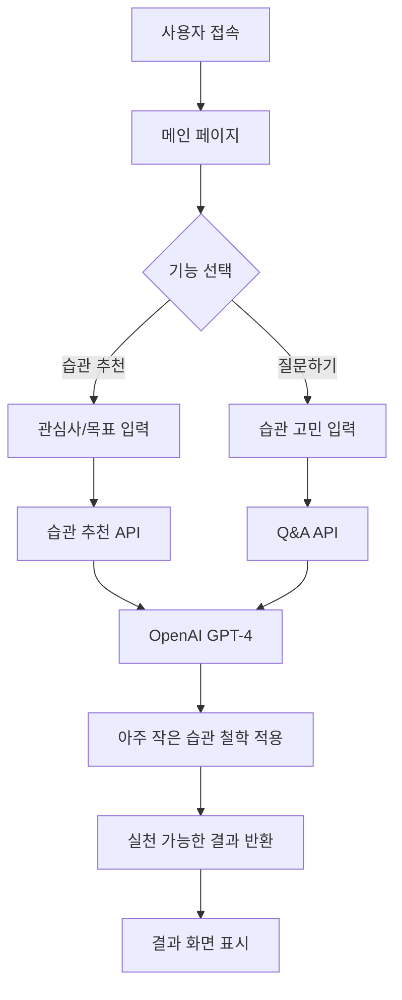
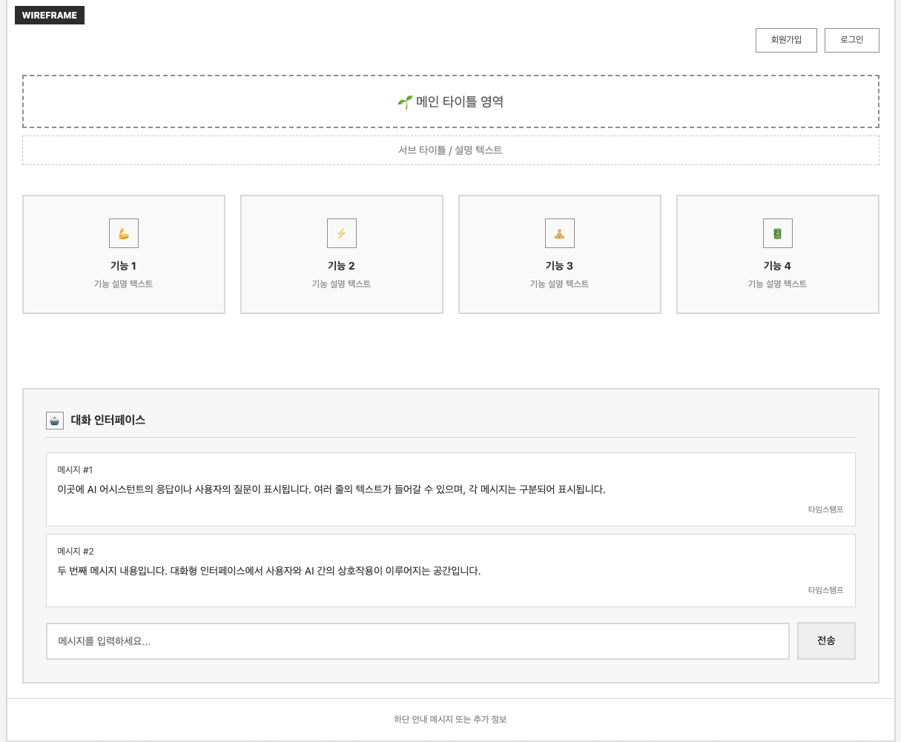
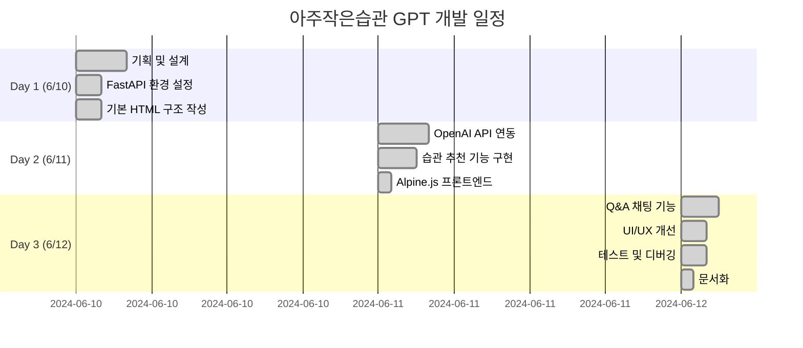

# 아주작은습관 GPT

## 📌 프로젝트 개요

### 프로젝트 목표
『아주 작은 습관』 책의 철학을 기반으로 한 GPT 기반 습관 형성 도우미 웹 애플리케이션을 개발하여, 사용자 맞춤형 작은 습관 추천을 통한 지속 가능한 행동 변화를 지원합니다.

### 핵심 가치
- **실천 가능성**: 2분 이내로 실행할 수 있는 아주 작은 습관에 집중
- **개인화**: 사용자의 관심사와 목표에 맞춤화된 습관 추천
- **접근성**: 미니멀한 웹 인터페이스로 습관 형성의 진입 장벽 최소화

### 주요 기능
- **맞춤형 습관 추천**: 건강, 생산성, 스트레스 관리 등 분야별 작고 실천 가능한 습관 제안
- **습관 개선 Q&A**: 습관 유지의 어려움, 동기부여 저하 등에 대한 『아주 작은 습관』 기반 솔루션 제공

---

## 🛠 기술 스택 및 개발 환경

### 개발 환경
- **개발 기간**: 2024년 6월 10일 ~ 6월 12일 (3일간)
- **개발 도구**: VS Code, Git
- **배포 상태**: 개발 완료, 배포 예정

### 기술 스택
| 분야 | 기술 | 선택 이유 |
|------|------|-----------|
| **Backend** | Python 3.11+, FastAPI | 빠른 개발, 자동 API 문서화, 비동기 처리 |
| **Frontend** | HTML5, CSS3, JavaScript, Alpine.js, TailwindCSS | 학습 곡선이 완만하고 빌드 과정 불필요 |
| **AI** | OpenAI GPT-4 API | 자연어 처리 및 맞춤형 조언 생성 |

### 프로젝트 구조
```
atomic_habit-gpt/
├── main.py              # FastAPI 백엔드 서버
├── index.html           # 메인 프론트엔드 페이지
├── .env                 # 환경변수
├── requirements.txt     # Python 의존성
└── README.md           # 프로젝트 문서
```

---

## 🏗 시스템 아키텍처

### API 엔드포인트
| 기능 | Method | Endpoint | 설명 | 응답 |
|------|--------|----------|------|------|
| 메인 페이지 | `GET` | `/` | HTML 페이지 서빙 | HTML 파일 |
| 습관 추천 | `POST` | `/api/habits/recommend` | 맞춤형 습관 추천 | GPT 추천 결과 |
| 질문 답변 | `POST` | `/api/habits/qa` | 습관 관련 Q&A | GPT 기반 조언 |
| 헬스체크 | `GET` | `/health` | 서버 상태 확인 | 서버 상태 |

### 시스템 플로우


---

## 📱 UI/UX 설계

### 와이어프레임


## 🗓 개발 일정



---

## 💻 핵심 코드 구조

### Backend (FastAPI)
```python
from fastapi import FastAPI
from fastapi.staticfiles import StaticFiles
import openai

app = FastAPI()

@app.post("/api/habits/recommend")
async def recommend_habits(request: RecommendRequest):
    """사용자 목표 기반 맞춤형 습관 추천"""
    # GPT를 활용한 습관 추천 로직
    
@app.post("/api/habits/qa") 
async def habit_qa(request: ChatRequest):
    """습관 관련 Q&A 처리"""
    # 습관 개선 조언 생성 로직
```

### Frontend (Alpine.js)
```html
<div x-data="habitApp()">
    <form @submit.prevent="getRecommendation">
        <input x-model="userGoal" placeholder="목표를 입력하세요">
        <button type="submit">습관 추천받기</button>
    </form>
    
    <div x-show="loading">추천 중...</div>
    <div x-show="recommendation" x-html="recommendation"></div>
</div>
```

---

## 🐛 문제 해결 과정

### OpenAI API 응답 지연 문제
**문제 상황**: GPT API 호출 시 5-10초 소요로 사용자 경험 저하

**해결 방안**:
```python
@app.post("/api/habits/qa")
async def recommend_habits(request: RecommendRequest):
    # async/await로 논블로킹 처리
    response = await openai.ChatCompletion.acreate(...)
```

**적용 결과**:
- FastAPI의 비동기 처리로 서버 성능 최적화
- Alpine.js 로딩 UI로 사용자 경험 개선
- 처리 상태를 명확히 전달하여 이탈률 감소

### 프롬프트 품질 최적화
**문제 상황**: GPT 응답이 『아주 작은 습관』 철학과 맞지 않거나 추상적인 조언 제공

**해결 방안**:
```python
HABIT_PROMPT = """
당신은 『아주 작은 습관』의 전문가입니다.
다음 원칙을 반드시 따라 습관을 추천해주세요:

1. 2분 이내로 실행 가능한 아주 작은 습관
2. 기존 루틴에 연결 가능한 습관 스태킹
3. 즉시 시작할 수 있는 구체적인 행동
4. 완벽보다는 일관성을 강조
"""
```

**적용 결과**:
- 책의 핵심 원칙을 프롬프트에 구체적으로 명시
- 실행 가능하고 측정 가능한 습관 추천 품질 향상
- 사용자 만족도 및 실천율 증가

### Alpine.js 상태 관리 충돌
**문제 상황**: 여러 API 호출 시 상태 충돌 및 UI 업데이트 이슈

**해결 방안**:
```javascript
function habitApp() {
    return {
        // 기능별 독립적 상태 관리
        recommendState: { loading: false, result: null },
        chatState: { loading: false, messages: [] },
        
        async getRecommendation() {
            this.recommendState.loading = true;
            // API 호출 및 상태 업데이트
        }
    }
}
```

**적용 결과**:
- 기능별 상태 객체 분리로 충돌 방지
- 로딩 상태와 결과 상태의 명확한 구분
- Alpine.js 반응성을 활용한 자동 UI 업데이트

---

## 🎯 프로젝트 회고

### AI 도구 활용의 인사이트

**Claude AI의 인상적인 능력**  
ChatGPT 경험만 있던 상황에서 Claude의 코드 맥락 파악과 의도 이해 능력은 놀라웠습니다. 특히 웹 개발이 익숙하지 않은 상태에서도 원하는 기능을 정확히 구현해주는 능력이 뛰어났습니다.

**기술 의존성에 대한 고민**  
AI 도구의 도움으로 빠른 개발이 가능했지만, "내가 진짜 개발한 것인가?"라는 의문이 들었습니다.

### 개발자 역할의 재정의

AI가 코드를 잘 작성해주더라도, **문제 정의, 기술 선택, 아키텍처 설계, 사용자 경험 설계**는 여전히 사람의 고유 영역임을 확인했습니다. AI 시대의 개발자는 코드 작성자가 아닌 **문제 해결자**여야 한다는 인사이트를 얻었습니다.
결국 지식이 있는 사람이 AI도 이용 할 수 있는것은 변하지않았기에 배움을 멈출수가 없습니다.
